# Разработка BI-системы для исследования учебных планов образовательных программ университетов

## Gang of Four Patterns
### Порождающие паттерны
#### Factory
Используется для порождения парсеров учебных планов, реализующих ParserProtocol. Парсеры резолвятся с помощью встроенного в ParserFactory словаря с возможными парсерами.


```
class ParserProtocol(Protocol):
    
    @abstractmethod
    def parse(self, payload) -> dict:
        raise NotImplementedError

class ParserFactory:
    _parsers: Final = {
        "hse": {
            "basic": {
                "table": BasicHseParser
            },
            "anual": {
               AnualHseParser
            }
        },
        "psu": {
            PsuParser
        }
    }
    
    @staticmethod
    def choose_parser(data_type: str, university: str, plan_type: str) -> ParserProtocol:
        return ParserFactory._parsers[university][plan_type][data_type]()
```
#### Builder
Класс Query используется для создания запроса к базе данных с помощью ORM.
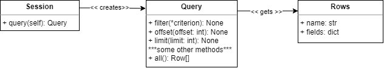
```
programs_pre_query = session \
                                    .query(
                                           MVP_API.program_id,
                                           MVP_API.program_name,
                                           MVP_API.field_code,
                                           MVP_API.degree_id,
			                               Degree.name.label("degree_name")
			                        ) \
                                    .filter(MVP_API.degree_id==Degree.id) \
                                    .offset(offset) \
                                    .limit(limit) \
        # Тут может добавиться код
        programs = programs_pre_query.all() # выполняется собранный запрос
```
#### Prototype
Представим метод для создания объекта AuthData, используемый при авторизации, на основе существующего. В Python методы __copy__ и __deepcopy__ зашиты на уровне языка и переопределены с помощью рефлексии, поэтому в данном примере их наследование опущено.

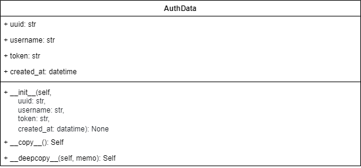
```
class AuthData:

    def __init__(self,
                 uuid: str,
                 username: str,
                 token: str,
                 created_at: datatime):

        self._uuid = uuid
	self._username = username
	self.token = token
	self.created_at = created_at

    @property
    def uuid(self):
      	return self._uuid

    @property
    def username(self):
      	return self.username

    def __copy__(self):
        cls = self.__class__
        result = cls.__new__(cls)
        result.__dict__.update(self.__dict__)
        return result

    def __deepcopy__(self, memo):
        cls = self.__class__
        result = cls.__new__(cls)
        memo[id(self)] = result
        for k, v in self.__dict__.items():
            setattr(result, k, deepcopy(v, memo))
        return result

 
import copy
data = AuthData("a", "b", "uuid", datetime.now()) # старый объект
new_data = copy.deepcopy(data) # копия
new_data.token = "token"
```

#### Singleton
В данном случае этот паттерн может быть использован, чтобы создать обертку для объекта, отвечающего за доступ к базе данных

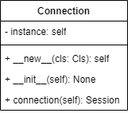

```
class Connection:

    def __new__(cls):
        if not hasattr(cls, 'instance'):
             cls.instance = super(SingletonClass, cls).__new__(cls)
        return cls.instance

    def __init__(self):
	SQLALCHEMY_DATABASE_URL = os.getenv('POSTGRES_CONNECTION_STRING')
	Engine = create_engine(SQLALCHEMY_DATABASE_URL)
        self._sessionmaker = sessionmaker(autocommit=False, autoflush=False, bind=Engine)

    @property
    def connection(self):
	return self._sessionmaker()
```

### Структурные паттерны
#### Decorator
На настоящий момент Decorator в его чистом виде используется редко, вместо это зачастую используют его функциональную альтернативу. Декоратор get оборачивает функцию и корректирует поведение вложенного метода.

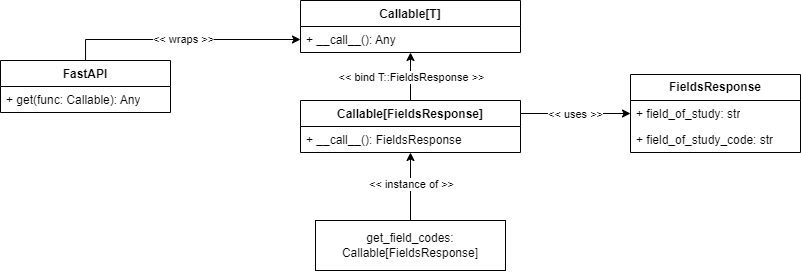
```
@app.get("/programs/fields",
         summary="Список направлений подготовки",
         description="""Список направлений подготовки, для которых найдены программы""",
)
def get_field_codes() -> FieldsResponse:
    field_codes_rows = select_fields()
    fields = fields_from_rows(field_codes_rows)
    return FieldsResponse(field_codes=fields)
```

Более ортодоксальный вариант применения для кэширования запросов к Базе Данных
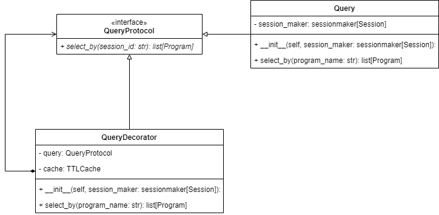
```
class QueryProtocol(Protocol):

        @abstractmethod
	def __init__(self, session_maker: sessionmaker[Session]=SessionMaker):
		self._session_maker = session_maker

        @abstractmethod
	def select_by(program_name: str) -> list[Program]:
		pass

class Query(QueryProtocol):
	def __init__(self, session_maker: sessionmaker[Session]=SessionMaker):
		self._session_maker = session_maker

	def select_by(program_name: str) -> list[Program]:
	    with session_maker() as session:
	        programs_pre_query = session \
	                                    .query(
	                                           MVP_API.program_id,
	                                           MVP_API.program_name,
	                                           MVP_API.field_code,
	                                           MVP_API.degree_id,
			                           Degree.name.label("degree_name")
                                                   ) \
	                                    .filter(MVP_API.degree_id==Degree.id) \
                                            .filter(MVP_API.program_name==program_name.id)

    	return programs_pre_query.all()

class QueryDecorator(QueryProtocol):
	def __init__(self, session_maker: sessionmaker[Session]=SessionMaker):
		self._query = QueryProtocol(session_maker)
		self._cache = TTLCache(maxsize=10, ttl=360)

	def select_by(program_name: str) -> list[Program]:
		try:
			programs = self._cache["program_name"]
  
		except KeyError:
			programs = self._query.select_by(program_name)
			self._cache["program_name"] = programs

    		return programs
```

#### Facade
Данный паттерн используется работе для упрощения запросов к базе данных

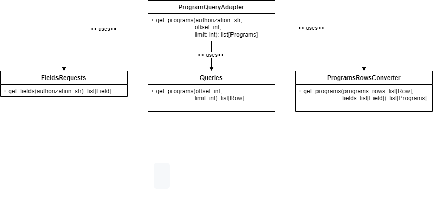
```
class Queries:
	def select_programs(self, filter: Optional[dict[str, list]]=None,
	                    session_maker: sessionmaker[Session]=SessionMaker,
			    offset: int=0,
			    limit: int=20):
	# Query

class FieldsRequests:
	def get_fields(self, authorization):
	    
	    fields = request(
	            headers={"Authorization": authorization},
	            method="GET",
	            url=fields_url
	            )
	    return fields


class ProgramsRowsConverter:
	def programs_from_rows(self, programs_rows, fields) -> list[Program]:
	    
	    return [Program(
	                    program_id=p.program_id,
	                    program_name=p.program_name,
	                    degree_id=p.degree_id,
	                    degree=p.degree_name,
	                    field_code=p.field_code,
	                    field_name=fields[p.field_code]["field_name"],
	                    field_group_code=fields[p.field_code]["field_group_code"],
	                    field_group_name=fields[p.field_code]["field_group_name"]
	                   )
	            for p
	            in programs_rows
	    if p.field_code in fields.keys()]

class ProgramQueryAdapter:
	def get_programs(self, authorization, offset, limit):
            programs_rows = select_programs(offset=args.offset,
		                            limit=args.limit)
            fields = {f["field_code"]: f 
	              for f 
	              in get_fields(authorization).json()}
            return ProgramsRowsConverter().programs_from_rows(programs_rows, fields)
```

#### Adapter
При распиливании приложения на сервисы было необходимо добавить логику запроса данных из внешних источников.

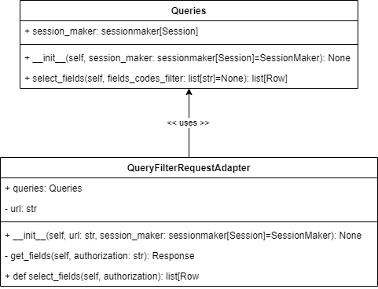
```
class Queries:
	def __init__(self, session_maker: sessionmaker[Session]=SessionMaker):
		self._session_maker = session_maker

	def select_fields(self, fields_codes_filter: list[str]=None):
	    __fos1 = aliased(FieldOfStudy)
	    __fos2 = aliased(FieldOfStudy)
	    with self._session_maker() as session:
	        fields_pre_query = session \
	                                    .query(
	                                           __fos1.field_code,
	                                           __fos1.field_name,
	                                           __fos2.field_code.label("field_group_code"),
	                                           __fos2.field_name.label("field_group_name"),
	                                    ) \
	                                    .filter(__fos1.field_group_code==__fos2.field_code) \
	                                    .order_by(
	                                              __fos2.field_code,
	                                              __fos1.field_code
	                                             )
	        
	        if fields_codes_filter:
	            fields_pre_query = fields_pre_query.filter(__fos1.field_code.in_(fields_codes_filter))
	            
	        return fields_pre_query.distinct().all()


class QueryFilterRequestAdapter:
	def __init__(self, url, session_maker: sessionmaker[Session]=SessionMaker):
		self.queries = Queries(session_maker)
		self._url = url

	def get_fields(self, authorization):
	    fields_codes_filter = request(
	            method="GET",
	            headers={"Authorization": authorization},
	            url=self._url
	        )
	    
	    return fields_codes_filter

	def select_fields(self, authorization):
		fields_codes_filter = [f['field_code']
                                       for f
                                       in self.get_fields(authorization).json()["field_codes"]]
		return select_fields(fields_codes_filter)
```

#### Proxy
В данном примере используем для кэширования запросов к Базе Данных. Так как Python динамический язык, то по сути паттерн Proxy взаимозаменяем с паттерном Decorator

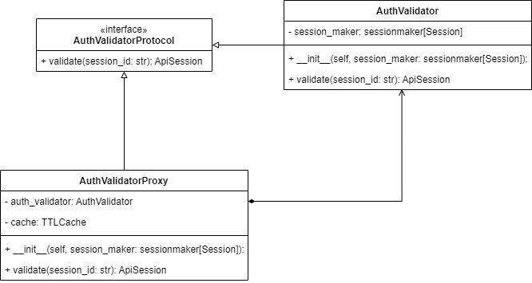
```
class AuthValidatorProtocol(Protocol):
        @abstractmethod
	def validate(session_id: str) -> ApiSession:
		pass

class AuthValidator(AuthValidatorProtocol):
	def __init__(self, session_maker: sessionmaker[Session]=SessionMaker):
		self._session_maker = session_maker

	def validate(session_id: str) -> ApiSession:
	    current_time = datetime.utcnow()
	    two_day_ago = current_time - timedelta(hours=48)
	    with self._session_maker() as session:
	        api_session = session \
	                             .query(ApiSession) \
	                             .filter(
	                                     and_(
	                                          ApiSession.session_id==session_id,
	                                          ApiSession.created_at > two_day_ago
	                                     )
	                             ) \
	                             .order_by(desc(ApiSession.created_at)) \
	                             .first()
	                    
	    
	    return ApiSession(
	                      session_id=session.session_id,
	                      created_at=session.created_at
	                     )

class AuthValidatorProxy(AuthValidatorProtocol):
	def __init__(self, session_maker: sessionmaker[Session]=SessionMaker):
		self._auth_validator = AuthValidator(session_maker)
		self._cache = TTLCache(maxsize=10, ttl=360)

	def validate(session_id: str) -> ApiSession:
		try:
			session = self._cache["session_id"]
                        current_time = datetime.utcnow()
			two_day_ago = current_time - timedelta(hours=48)
			if session.created_at < two_day_ago:
				return None
		except KeyError:
			session = self._auth_validator.validate(session_id)
			self._cache["session_id"] = session

    		return ApiSession(
	                      	  session_id=session.session_id,
	                      	  created_at=session.created_at
	                    	 )
```

### Поведенческие паттерны
#### Iterator
Паттерн Iterator зашит в язык программирования Python как стандартный метод для перебора коллекции. Для этого используются встроенные методы __iter__ (для создания итератора) и метод __next__ для его перебора. Python опускает реализацию метода hasNext, вместо этого выбрасывая исключение StopIteration при отсутствии элемента.


```
class Fields:

	def __init__(self, fields):
	    self._fields = fields

	def __iter__(self):
	    return FieldsIterator(self)

class FieldsGroupIterator:
    	def __iter__(self):
	    return self

	def __init__(self, fields):
	    self._fields = fields._fields
  	    self._idx = 0

	def __next__(self):
	    while self._idx < len(self._fields):
		if self._fields[self._idx].group is None:
		     self._idx += 1
                     return self._fields[self._idx]
		self._idx += 1
			
	    self._idx = 0
	    raise StopIteration()
```

#### Template Method
Используем, чтобы декомпозировать верхнеуровнево парсинг учебных планов. Создадим два метода, один из которых читает служебную информацию, а другой — основное содержание

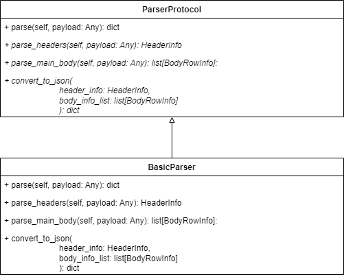
```
class ParserProtocol(Protocol):
    """The uniform interface all parsers shall follow"""
    
    def parse(self, payload) -> dict:
	headers = parse_headers(payload)
        body = parse_main_body(payload)
	return convert_to_json(headers, body)

    @abstractmethod
    def parse_headers(self, payload) -> HeaderInfo:
        raise NotImplementedError

    @abstractmethod
    def parse_main_body(self, payload) -> list[RowInfo]:
        raise NotImplementedError

    @abstractmethod
    def convert_to_json(header_info: HeaderInfo, body_info_list: list[RowInfo]) -> dict:
        raise NotImplementedError

class BasicParser(ParserProtocol):

    @override
    def convert_to_json(header_info: HeaderInfo, body_info_list: list[BodyRowInfo]) -> dict:
        json_dict = {
		"ProgramInfo": {
		        "name": header_info.programme_name,
		        "fields_of_study": __get_fields_of_study(header_info),
		        "degree": __get_degree(header_info),
		        "yearEnrolled": header_info.enrollment_year,
		        "courses": __get_courses(body_info_list)
            	 }
        }

    return json_dict

    @override
    def parse_header(payload):
        header_info = HeaderInfo()
	
        header_info.speciality_codes = get_speciality_codes(payload)
        header_info.speciality_names = get_speciality_name_list(payload)
        header_info.programme_name = get_programme_name(payload)
        header_info.faculty = get_faculty(payload)
        header_info.enrollment_year = get_enrollment_year(payload)
        header_info.study_year_count = get_study_year_count(payload)
        header_info.degree = get_degree(payload)
        return = header_info

   @override
   def parse_body(payload) -> list[BodyRowInfo]:
       first_row = document_df.iloc[0, :]

       has_course_type_column = find_first_index(first_row, "Вид") is not None
       credits_col_index = find_first_index(first_row, "Трудоемкость")
       last_col_index = len(document_df.columns) - 1

       body_info_list = []

       for row_index, row in document_df.iterrows():
	        row_values = row.tolist()
	        first_value = row_values[0]
	
	        if not isinstance(first_value, str) or not first_value.isdigit():
	            continue
	
	        # if row's "Код цикла" isn't "1", not change specialization name
	        # otherwise, try to find name in previous rows
	        possible_specialization = try_define_specialization(document_df, row_index, first_value)
	        if possible_specialization is not None:
	            specialization = possible_specialization
	
	        body_info = BodyRowInfo()
	        body_info.specialization = specialization
	        body_info.course_name = row_values[1]
	
	        if has_course_type_column:
	            body_info.course_type = CourseType(row_values[2])
	        else:
	            previous_course_type = define_course_type(document_df, row_index, previous_course_type)
	            body_info.course_type = previous_course_type
	
	        credits_list, years = __get_credits_and_years(row_values, credits_col_index, last_col_index)
	        body_info.credits.extend(credits_list)
	        body_info.course_years.extend(years)
	
	        last_value = row_values[last_col_index]
	
	        # value might be undefined
	        if isinstance(last_value, str):
	            body_info.competence_codes = [code.strip() for code in last_value.split(",") if code.strip() != ""]
	
	        body_info_list.append(body_info)
	
        return body_info_list
```
#### Strategy
Используется, чтобы выбрать парсер

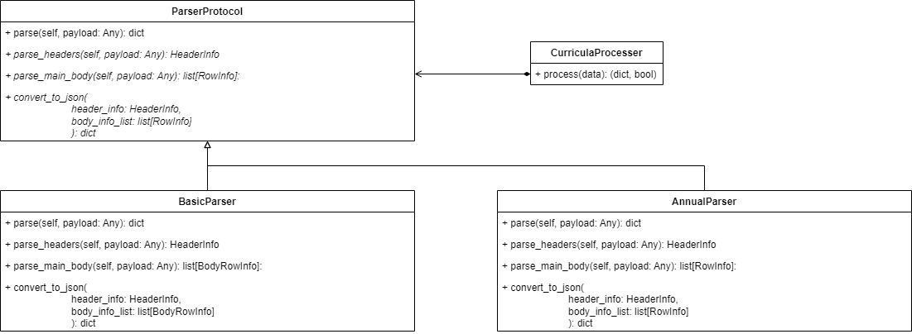
```
### См. пример выше и приведенный ниже код

class AnnualParser:

    @override
    def convert_to_json(header_info: HeaderInfo, body_info_list: list[RowInfo]) -> dict:
        json_dict = {
		"ProgramInfo": {
		        "name": header_info.programme_name,
		        "courses": __get_courses(body_info_list)
            	 }
        }

    return json_dict

    @override
    def parse_header(payload):
        header_info = HeaderInfo()
	
        header_info.programme_name = get_programme_name(payload)
        return = header_info

    @override
    def parse_body(self, payload):

        pdf_path = payload

        header_text_list = get_pdf_page_text(pdf_path, 0, True).split("\n")
        header_text_list = [text.strip() for text in header_text_list if text]
        
        df = get_data_frame_by_pdf_path(pdf_path,
                                        table_settings={"text_x_tolerance": 1, "vertical_strategy": "lines_strict"})
        df = prepare_table(df)
        df = get_corrected_df(df)

        programme = get_programme_name(header_text_list)
        year, enrolled_in = get_year_and_enrolled_in(header_text_list)

        result_table = []

        for row_index, row in df.iterrows():
            course_name = row['dscpl']
            department = row['podr']
            credits = row['cred']
            first_sem_hours = get_hours(row['hours_mod1']) + get_hours(row['hours_mod2'])
            second_sem_hours = get_hours(row['hours_mod3']) + get_hours(row['hours_mod4'])

            result_table.append(
                [course_name, programme, credits, year, department, enrolled_in, first_sem_hours, second_sem_hours])

        return pd.DataFrame(result_table, columns=[
            'CourseName',
            'Programme',
            'Credits',
            'Year',
            'Department',
            'EnrolledIn',
            'FirstSemesterContactHours',
            'SecondSemesterContactHours'
        ])

class CurriculaProcesser:

	def __init__(self, parser: ParserProtocol, validator: ValidatorProtocol):
	    self._parser = parser
            self._validator = validator

	def process(data):
	    result = self._parser.parse(data)
            is_valid = self._validator.validate(result)
	    return result, is_valid
```

#### Command
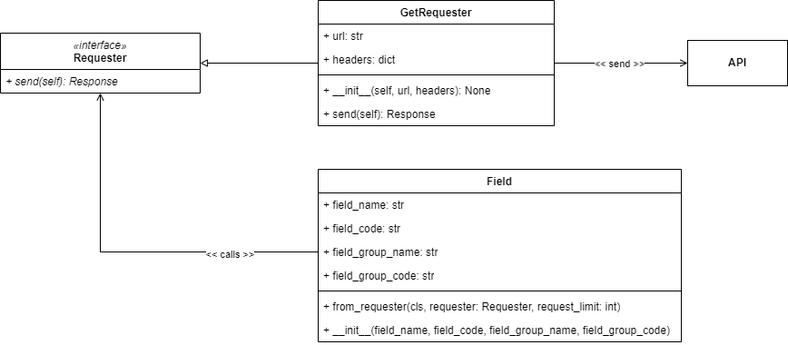
```
class Requester(Protocol):

    @abstractmethod
    def send(self):
        raise NotImplementedError

class GetRequester(Requester):

    def __init__(self, url, headers):
	self.url = url
	self.headers = headers
	self.authorization = authorization

    def send(self):
        response = request(
            method="GET",
            headers=headers,
            url=programs_url
        )
	if response.ok:
        	return response.status_code, response.json()
	else:
		return response.status_code, dict()

class Field:

    def __init__(field_name, field_code, field_group_name, field_group_code):
        self.field_name = field_name
	self.field_code = field_code
	self.field_group_name = field_group_name
	self.field_group_code = field_group_code

    @classmethod  
    def from_requester(cls, requester, request_limit):
	n = 0
	while n < request_limit:
            n += 1
            status, response = self.requester.send()
            if status < 400:
                break
            if n == request_limit:
	    return

	obj = cls()
	obj.field_name = response["field_name"]
	obj.field_code = response["field_code"]
	obj.field_group_name = response["field_group_name"]
	obj.field_group_code = response["field_group_code"]
	return obj
```

## Шаблоны проектирования GRASP
### Protected Variations
• <b>Проблема: </b>необходимо спроектировать систему так, чтобы изменение одних её элементов не влияло на другие <br/>
• <b>Решение: </b>идентифицировать точки возможных изменений или неустойчивости и распределить обязанности так, чтобы обеспечить устойчивую работу системы <br/>
• <b>Пример: </b> Реализация паттерна Adapter в контексте данной работы помогла справиться с изменениями почти без рефакторинга существующего кода. Также применена реализация паттерна Prototype с помощью рефлексии, что делает код устойчивым к изменению. Так же частично проблема решается с помощью Polymorphism <br/>
• <b>Результаты: </b>Внося изменения в одни части программы нет необходимости изменять другие части программы <br/>
• <b>Связь с другими паттернами: </b>похож на Open Closed Principle в SOLID и частично связан с Полиморфизмом <br/>

### Polymorphism
• <b>Проблема: </b>необходимо обрабатывать различные варианты поведения на основании типа, допуская замену частей системы <br/>
• <b>Решение: </b>распределить обязанности между классами с использованием полиморфных операций, оставив каждой внешней системе свой интерфейc <br/>
• <b>Пример: </b> Полиформная реализация добавления в Базу Данных с помощью завимисимости на базовый класс <br/>
```
class BaseModel(DeclarativeBase):
    """Base class for mappings"""
    pass

class Query:
    def add(self, entity: BaseModel):
        with self._session_maker() as session:
            try:
                session.add(entity)
                session.commit()
                session.refresh(entity)
                status = True
            except:
                status = False
                # There will be logging
        return status
```
• <b>Результаты: </b>Подключаемые компоненты системы будут заменяемыми <br/>
• <b>Связь с другими паттернами: </b> Strategy, так же необходимо соблюдать Liskov Substitution, принципы SOLID в целом <br/>

### Pure Fabrication
• <b>Проблема: </b> необходимо обеспечивать Low Coupling и High Cohesion <br/>
• <b>Решение: </b> синтезировать искусственную сущность для обеспечения Low Coupling и High Cohesion <br/> 
• <b>Пример: </b> см. Facade, Proxy, запросы к Базе Данных <br/>
• <b>Результаты: </b> Бизнес-логика не смешивается с логикой приложения, на уровне архитектуры лучше поддерживаются Low Coupling и High Cohesion <br/>
• <b>Связь с другими паттернами: </b> самый яркий вариант реализации — Facade или Proxy <br/>

### Indirection
• <b>Проблема: </b>необходимо распределить обязанности объектов, избежав прямого связывания <br/>
• <b>Решение: </b>присвоить обязанности по обеспечению связи между компонентами или службами промежуточному объекту <br/> 
• <b>Пример: </b> В данной работе использовалось для избегания "хардкода" парсеров в исполняемый код и вынесения логики запросов в отдельный модуль. См. паттерны Strategy или Command <br/>
• <b>Результаты: </b>Заменяемость частей системы, возможность их повторного использования <br/>
• <b>Связь с другими паттернами: </b>похож на Dependency Inversion Principle в SOLID, отчасти Strategy или Command <br/>

### Controller
• <b>Проблема: </b>необходимо обрабатывать входные системные события. Часто события от акторов обрабатываются в многопоточном режиме <br/>
• <b>Решение: </b>назначить обязанность обработки входных системных событий специальному классу (внешний контроллер или контроллеры прецедентов) <br/>
• <b>Пример: </b> Логика фреймворка API <br/>
```
@app.get("/programs/fields",
         summary="Список направлений подготовки",
         description="""Список направлений подготовки, для которых найдены программы""",
)
def get_field_codes() -> FieldsResponse:
    field_codes_rows = select_fields()
    fields = fields_from_rows(field_codes_rows)
    return FieldsResponse(field_codes=fields)
```
• <b>Результаты: </b>В бизнес-логике нет многопоточности <br/>
• <b>Связь с другими паттернами: </b>следует принципу разделения ответственности и MVC, отчасти иллюстрирует паттерн Facade <br/>

### Information Expert
• <b>Проблема: </b>информация в системе должна обрабатываться, аккумулироваться, рассчитываться и т.п. <br/>
• <b>Решение: </b>назначить соответствующие обязанности тому классу, который её содержит <br/>
• <b>Пример: </b> Весь Persistance (см. прошлые примеры и данный как продолжение) <br/>
```
class Query:
	def __init__(self, session_maker: sessionmaker[Session]=SessionMaker):
		self._session_maker = session_maker

	def select_fields(self, fields_codes_filter: list[str]=None):
	    __fos1 = aliased(FieldOfStudy)
	    __fos2 = aliased(FieldOfStudy)
	    with self._session_maker() as session:
	        fields_pre_query = session \
	                                    .query(
	                                           __fos1.field_code,
	                                           __fos1.field_name,
	                                           __fos2.field_code.label("field_group_code"),
	                                           __fos2.field_name.label("field_group_name"),
	                                    ) \
	                                    .filter(__fos1.field_group_code==__fos2.field_code) \
	                                    .order_by(
	                                              __fos2.field_code,
	                                              __fos1.field_code
	                                             )
	        
	        if fields_codes_filter:
	            fields_pre_query = fields_pre_query.filter(__fos1.field_code.in_(fields_codes_filter))
	            
	        return fields_pre_query.distinct().all()
```
• <b>Результаты: </b>Соблюдается принцип инкапсуляции, уменьшается связанность классов <br/>
• <b>Связь с другими паттернами: </b>Model (в MVC), объект предметной области <br/>

### Creator
• <b>Проблема: </b>экземпляры класса необходимо создавать <br/>
• <b>Решение:  </b>назначить обязанности инстанциирования тому классу, который будет использовать соответствующие экземпляры созданных классов<br/>
• <b>Пример: </b> Инициализация объекта, отвечающего за связь с базой данных при инициализации объекта отвечающего за отправку запросов <br/>
```
class Query:
	def __init__(self, session_maker: sessionmaker[Session]=SessionMaker):
		self._session_maker = session_maker
```
• <b>Результаты: </b>Соблюдается принцип инкапсуляции, уменьшается связанность классов <br/>
• <b>Связь с другими паттернами: </b>Abstract Factory, Dependency Injection <br/>

### Low Coupling
• <b>Проблема: </b>необходимо обеспечивать низкую связанность между классами <br/>
• <b>Решение: </b>распределить обязанности так, чтобы степень связанности оставалась низкой <br/>
• <b>Пример: </b>см. Indirection, Factory, Polymorphism <br/>
• <b>Результаты: </b>Отсутствует необходимость согласованных изменений классов. Классы становятся более пригодны для повторного использования. Классы более легко поддерживать <br/>
• <b>Связь с другими паттернами: </b>похож на Dependency Inversion Principle​ в SOLID <br/>

### High Cohesion
• <b>Проблема: </b>необходимо обеспечивать выполнение объектами разнородных функций <br/>
• <b>Решение: </b>распределить обязанность так, чтобы обеспечить высокое зацепление <br/>
• <b>Пример: </b>Разделение бизнес-логики в приложении в целом, см. класс Query и логику-запросов Requester<br/>
```
class Query:
        def add(self, entity: BaseModel):
	        with self._session_maker() as session:
	            try:
	                session.add(entity)
	                session.commit()
	                session.refresh(entity)
	                status = True
	            except:
	                status = False
	                # There will be logging
	        return status

	def __init__(self, session_maker: sessionmaker[Session]=SessionMaker):
		self._session_maker = session_maker

	def select_fields(self, fields_codes_filter: list[str]=None):
	    __fos1 = aliased(FieldOfStudy)
	    __fos2 = aliased(FieldOfStudy)
	    with self._session_maker() as session:
	        fields_pre_query = session \
	                                    .query(
	                                           __fos1.field_code,
	                                           __fos1.field_name,
	                                           __fos2.field_code.label("field_group_code"),
	                                           __fos2.field_name.label("field_group_name"),
	                                    ) \
	                                    .filter(__fos1.field_group_code==__fos2.field_code) \
	                                    .order_by(
	                                              __fos2.field_code,
	                                              __fos1.field_code
	                                             )
	        
	        if fields_codes_filter:
	            fields_pre_query = fields_pre_query.filter(__fos1.field_code.in_(fields_codes_filter))
	            
	        return fields_pre_query.distinct().all()


```
```
class Requester(Protocol):

    @abstractmethod
    def send(self):
        raise NotImplementedError

class GetRequester(Requester):

    def __init__(self, url, headers):
	self.url = url
	self.headers = headers
	self.authorization = authorization

    def send(self):
        response = request(
            method="GET",
            headers=headers,
            url=programs_url
        )
	if response.ok:
        	return response.status_code, response.json()
	else:
		return response.status_code, dict()
```
• <b>Результаты: </b>Несколько контекстов смешивается в одном классе, Классы более легко поддерживать <br/>
• <b>Связь с другими паттернами: </b>похож на Single Responsibility Principle в SOLID <br/>
