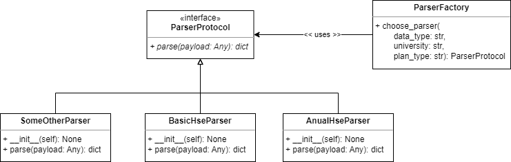

# Разработка BI-системы для исследования учебных планов образовательных программ университетов

## Gang of Four Patterns
### Порождающие паттерны
#### Factory
Используется для порождения парсеров учебных планов, реализующих ParserProtocol. Парсеры резолвятся с помощью встроенного в ParserFactory словаря с возможными парсерами.



```
class ParserProtocol(Protocol):
    
    @abstractmethod
    def parse(self, payload) -> dict:
        raise NotImplementedError

class ParserFactory:
    _parsers: Final = {
        "hse": {
            "basic": {
                "table": BasicHseParser
            },
            "anual": {
               AnualHseParser
            }
        },
        "psu": {
            PsuParser
        }
    }
    
    @staticmethod
    def choose_parser(data_type: str, university: str, plan_type: str) -> ParserProtocol:
        return ParserFactory._parsers[university][plan_type][data_type]()
```
#### Builder
Класс Query используется для создания запроса к базе данных с помощью ORM.
```
programs_pre_query = session \
                                    .query(
                                           MVP_API.program_id,
                                           MVP_API.program_name,
                                           MVP_API.field_code,
                                           MVP_API.degree_id,
			                               Degree.name.label("degree_name")
			                        ) \
                                    .filter(MVP_API.degree_id==Degree.id) \
                                    .offset(offset) \
                                    .limit(limit) \
        # Тут может добавиться код
        programs = programs_pre_query.all() # выполняется собранный запрос
```
